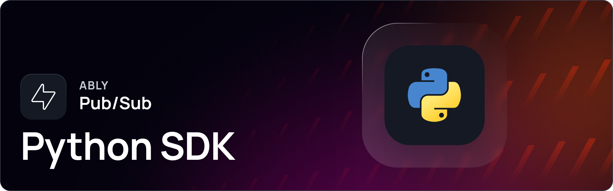

[](https://pypi.org/project/ably/)
[](https://github.com/ably/ably-python/blob/main/LICENSE)


# Ably Pub/Sub Python SDK

Build any realtime experience using Ably’s Pub/Sub Python SDK.

Ably Pub/Sub provides flexible APIs that deliver features such as pub-sub messaging, message history, presence, and push notifications. Utilizing Ably’s realtime messaging platform, applications benefit from its highly performant, reliable, and scalable infrastructure.

Find out more:

* [Ably Pub/Sub docs.](https://ably.com/docs/basics)
* [Ably Pub/Sub examples.](https://ably.com/examples?product=pubsub)

---

## Getting started

Everything you need to get started with Ably:

* [Getting started with Pub/Sub using Python.](https://ably.com/docs/getting-started/python)
* [SDK Setup for Python.](https://ably.com/docs/getting-started/setup?lang=python)

---

## Supported platforms

Ably aims to support a wide range of platforms. If you experience any compatibility issues, open an issue in the repository or contact [Ably support](https://ably.com/support).

The following platforms are supported:

| Platform | Support |
|----------|---------|
| Python | Python 3.7+ through 3.13 |

> [!NOTE]
> This SDK works across all major operating platforms (Linux, macOS, Windows) as long as Python 3.7+ is available.

> [!IMPORTANT]
> SDK versions < 2.0.0-beta.6 will be [deprecated](https://ably.com/docs/platform/deprecate/protocol-v1) from November 1, 2025.

---

## Installation

To get started with your project, install the package:

```sh
pip install ably
```

> [!NOTE]
Install [Python](https://www.python.org/downloads/) version 3.8 or greater.

## Usage

The following code connects to Ably's realtime messaging service, subscribes to a channel to receive messages, and publishes a test message to that same channel.

```python
# Initialize Ably Realtime client
async with AblyRealtime('your-ably-api-key', client_id='me') as realtime_client:
    # Wait for connection to be established
    await realtime_client.connection.once_async('connected')
    print('Connected to Ably')
    
    # Get a reference to the 'test-channel' channel
    channel = realtime_client.channels.get('test-channel')
    
    # Subscribe to all messages published to this channel
    def on_message(message):
        print(f'Received message: {message.data}')
    
    await channel.subscribe(on_message)
    
    # Publish a test message to the channel
    await channel.publish('test-event', 'hello world')
```

## Releases

The [CHANGELOG.md](https://github.com/ably/ably-python/blob/main/CHANGELOG.md) contains details of the latest releases for this SDK. You can also view all Ably releases on [changelog.ably.com](https://changelog.ably.com).

---

## Contribute

Read the [CONTRIBUTING.md](./CONTRIBUTING.md) guidelines to contribute to Ably.

---

## Support, feedback, and troubleshooting

For help or technical support, visit Ably's [support page](https://ably.com/support) or [GitHub Issues](https://github.com/ably/ably-python/issues) for community-reported bugs and discussions.

### Full Realtime support unavailable

This SDK currently supports only [Ably REST](https://ably.com/docs/rest) and basic realtime message subscriptions. To access full [Ably Realtime](https://ably.com/docs/realtime) features in Python, consider using the [MQTT adapter](https://ably.com/docs/mqtt).

